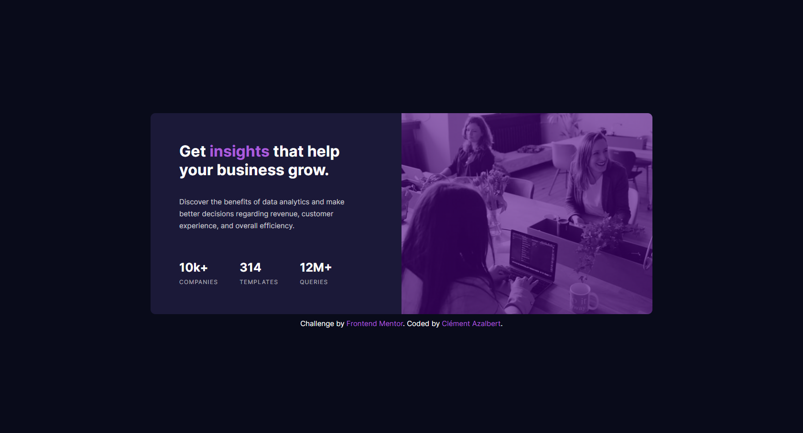
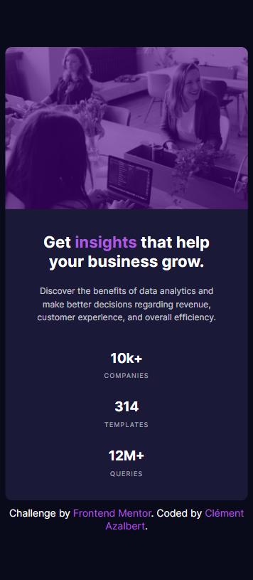

# Frontend Mentor - Stats preview card component solution

This is a solution to the [Stats preview card component challenge on Frontend Mentor](https://www.frontendmentor.io/challenges/stats-preview-card-component-8JqbgoU62). Frontend Mentor challenges help you improve your coding skills by building realistic projects.

## Table of contents

- [Overview](#overview)
  - [The challenge](#the-challenge)
  - [Screenshot](#screenshot)
  - [Links](#links)
- [My process](#my-process)
  - [Built with](#built-with)
  - [Continued development](#continued-development)
- [Author](#author)

## Overview

### The challenge

Users should be able to:

- View the optimal layout depending on their device's screen size

### Screenshot

Screenshot Desktop

Screenshot Mobile

### Links

- Solution URL: [Click here to see the solution](https://www.frontendmentor.io/solutions/stats-card-using-flexbox-and-grid-responsive-4skJKuK2r)
- Live Site URL: [Click here to see the live website](https://clemi05.github.io/stats-preview-card-frontend-mentors/)
- Repository URL: [Click here to see the repository](https://clemi05.github.io/stats-preview-card-frontend-mentors/)

## My process

### Built with

- Semantic HTML5 markup
- CSS custom properties
- Flexbox
- CSS Grid
- Media queries

### Continued development

I will focus on building challenges/projects and looking up some documentations
in order to improve my CSS skills, especially regarding media queries.

## Author

- Frontend Mentor - [@Clemi05](https://www.frontendmentor.io/profile/Clemi05)
- Github - [Clemi05](https://github.com/Clemi05)
- LinkedIn - [Clément Azalbert](https://www.linkedin.com/in/clement-azalbert/)
